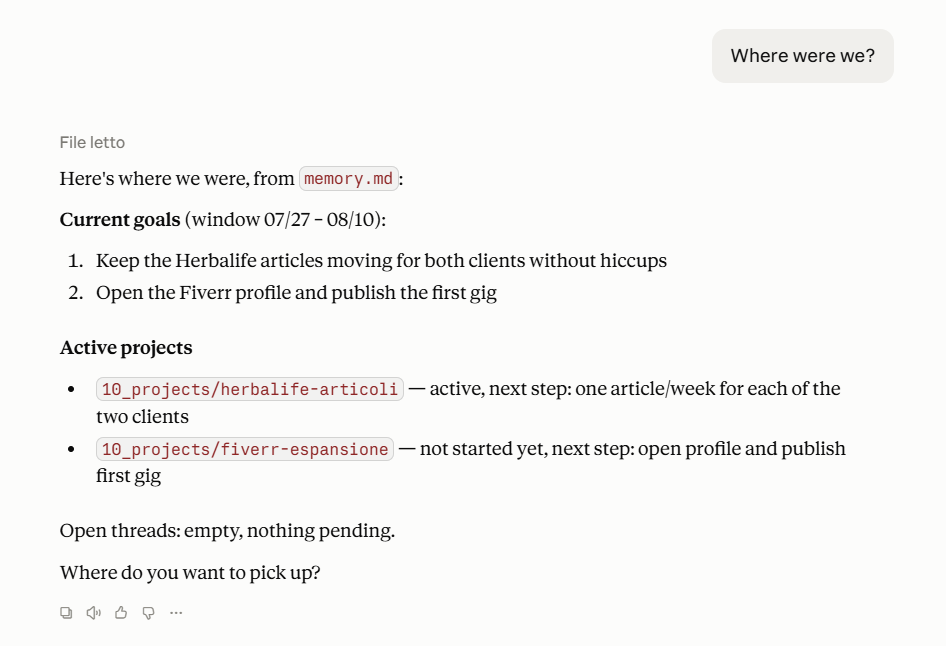

# Context_OS

A second brain for anyone who works with an AI assistant every day.
It’s not a note-taking system for you: it’s the file system that **your assistant reads by itself**, before answering, in every new session.

---

## The problem

You open a chat. The assistant doesn’t know who you are, what you’re working on, or what you decided yesterday. You explain everything again. Tomorrow you start over.
The more projects you have in parallel, the more this costs: time, tokens, and decisions that get lost because they stayed inside a closed conversation.

## The proof

You install the system, open a conversation and write “hello”. It asks you three questions, fills in the state, and you’re up and running.
Then you close the chat. You open a new one, days later:



You didn’t tell it anything. It read it.

---

## What it is, concretely

A folder of markdown files. No database, no account, no subscription, nothing running in the cloud. It opens with any editor, and with Obsidian you can also see the connections in a graph.
Inside there are three things:
**The rules** (`CLAUDE.md`) — what the assistant must do and where it should look. It’s the file that gets read first, automatically.
**The state** (`memory.md`) — who you are, what you’re doing, what’s pending. It changes continuously.
**The procedures** (`03_skills/`) — seven repeatable tasks the assistant knows how to perform: open a project, digest raw notes into linked notes, check that the system hasn’t broken, distill a skill into a file that can be recalled.
The rule that holds everything together: **the rules never contain state.** A file that says “the active project is X” goes stale in two days. The rules point to the state, they don’t copy it.

---

## How to get started

1. Download the folder and put it wherever you want on your computer.
2. Connect it to your assistant (in Claude: select it as the working folder).
3. Open a conversation and write anything.
The system notices on its own that it’s empty and asks you three questions. From there it’s operational.
The procedures in `03_skills/` work better if you load them as skills (Settings → Skills, one file at a time): that way they activate automatically when needed. The assistant will suggest this during the first startup.

---

## What’s inside

```
CLAUDE.md          rules + navigation map
memory.md          current state
archive.md         superseded decisions
00_context/        identity, distilled skills, feedback log
01_raw/            raw notes waiting to be digested
02_wiki/           consolidated knowledge, in linked atomic notes
03_skills/         the seven procedures
10_projects/       one folder per project
99_system/         the rules manual and the templates
```

---

## What it doesn’t do
It doesn’t sync itself across devices: it’s a folder, use whatever sync tool you prefer.
It doesn’t automatically import the notes you already have elsewhere. You put them in `01_raw/` and have them digested when you want.
It’s not designed for multiple people on the same system: it’s personal.
It was born and tested on Claude. Being text files with instructions in natural language, it works in principle with any assistant that can read and write files — but it has only been verified on Claude.

---

## FAQ
**How is it different from a note template?**
Those you read yourself. This one the assistant reads, by itself, every time.

**Do I need to know how to code?**
No. You read and write markdown.

**Where do my data end up?**
On your computer. The system doesn’t send anything anywhere.

**Does it consume more tokens?**
Less. The map in `CLAUDE.md` prevents the assistant from reading everything just to find one thing.

**What happens if I don’t follow the rules?**
Nothing breaks. You lose order, not data: they’re your files.

---

## License
MIT.
